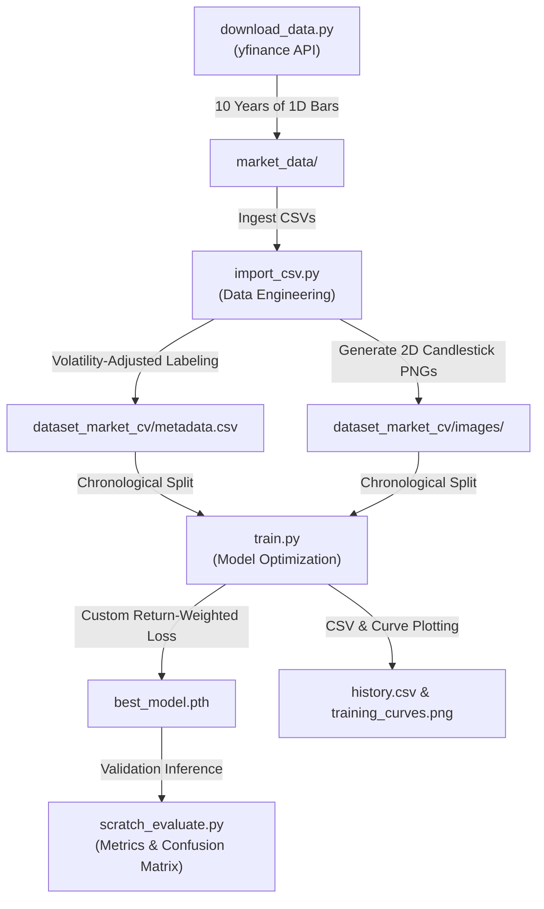

# Computer Vision Financial Price Prediction Pipeline

An end-to-end Deep Learning pipeline that frames quantitative financial forecasting as a **2D computer vision pattern recognition task**. 

Instead of feeding raw 1D numeric price sequences directly to a model, this project represents historical market states as min-max normalized **candlestick chart images** (incorporating Simple Moving Averages) and trains a custom regularized **Convolutional Neural Network (CNN)** to predict high-conviction breakout opportunities.

---

## 🏛️ Pipeline Architecture



---

## 🚀 Getting Started (How to Reproduce the Dataset)

Because the raw dataset and generated chart images are massive, they are excluded from Git via `.gitignore` to keep the repository extremely lightweight. Follow these three steps in your terminal to download the market data, regenerate the visual dataset, and start training.

### 1. Harvest Historical Market Data
Downloads **10 years** of daily historical OHLCV bars from Yahoo Finance for **10 major global currency pairs** (including `EURUSD`, `GBPUSD`, `USDJPY`, `AUDUSD`, `USDCAD`, `USDCHF`, `NZDUSD`, `EURGBP`, `EURJPY`, and `GBPJPY`):
```bash
python download_data.py
```
*Outputs: 10 raw CSV files saved inside `market_data/`.*

### 2. Generate the Visual Candlestick Dataset
Ingests the raw CSV bars, applies a sliding window of **20 days**, calculates 10 & 20-day Simple Moving Averages, applies local min-max scaling to isolate geometric shapes, and saves the plots:
```bash
python import_csv.py
```
* **Dynamic Volatility Labeling:** Rather than using a rigid target threshold, this script uses **volatility-adjusted labeling**. A trade is classified as a Buy (`1`) if the future 5-day return exceeds $1.5 \times$ the rolling standard deviation of daily returns scaled to the horizon.
* *Outputs: $\sim 25,000$ crop-aligned candlestick chart images saved inside `dataset_market_cv/images/` and logged in `dataset_market_cv/metadata.csv`.*

### 3. Train the Custom CNN Backbone
Trains the custom regularized 4-layer CNN (featuring Batch Normalization and $0.3$ Dropout to prevent memorization overfitting) on the generated dataset:
```bash
python train.py
```
* **Batch Balancing:** Uses PyTorch's `WeightedRandomSampler` to dynamically balance the training mini-batches (~50% Buy, ~50% No-Buy) during training.
* **F1 Checkpointing:** Saves the best weights to `best_model.pth` based on peak Validation F1-Score of the Buy class, rather than validation loss, to optimize trade signal selection.
* **Persistent Logging:** Automatically appends the hyperparameter settings and best checkpoint metrics to a root-level `experiment_log.csv` database for performance tracking.

---

## 📈 Evaluation & Performance Tracking

To run a deep inference evaluation of your saved checkpoint (`best_model.pth`) on the chronological validation split and output Precision, Recall, F1-Score, and a complete Confusion Matrix:
```bash
python scratch_evaluate.py
```